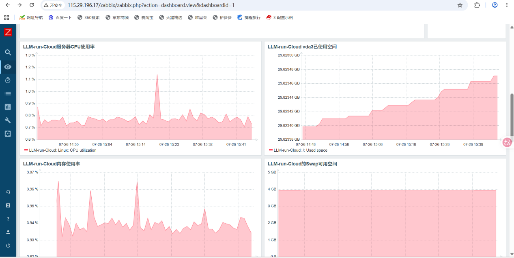
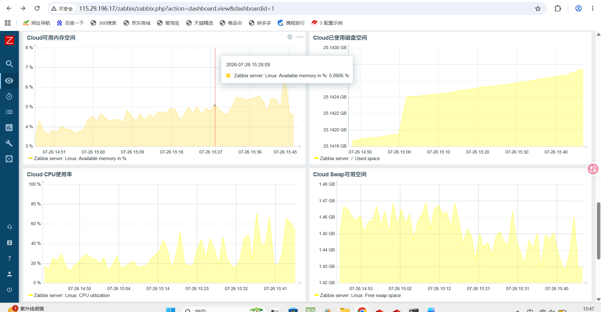

**步骤一：Zabbix Web端进行功能完善**

    添加相关数据图形在仪表盘

    点击仪表盘右上角添加图形组件

**步骤二：接入钉钉告警机器人**

    1.  先进钉钉群创建自定义机器人（名字belike：Zabbix告警监控，并记录Webhook）

    2.  登录Zabbix-Server端服务器，确认Zabbix-Server端自带的告警脚本存放路径
    grep AlertScriptsPath /etc/zabbix/zabbix_server.conf
    正常会看到以下路径：
    AlertScriptsPath=usr/lib/zabbix/alertscripts

    3.  进入zabbix_server配置文件，进行路径修改
    vi /etc/zabbix/zabbix_server.conf
    AlertScriptsPath=/usr/lib/zabbix/alertscripts
`注意：我的zabbix是6.0.xx版本，不同版本的zabbix配置文件需要修改的地方可能不太一样，视情况而定`

    4.  保存修改后重启zabbix-server服务
    systemctl restart zabbix-server.service

    5.  在/usr/lib/zabbix/alertscripts路径下

